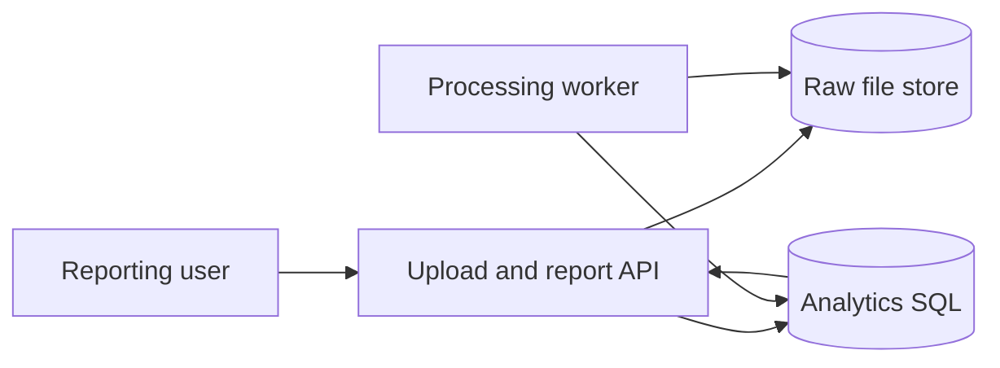
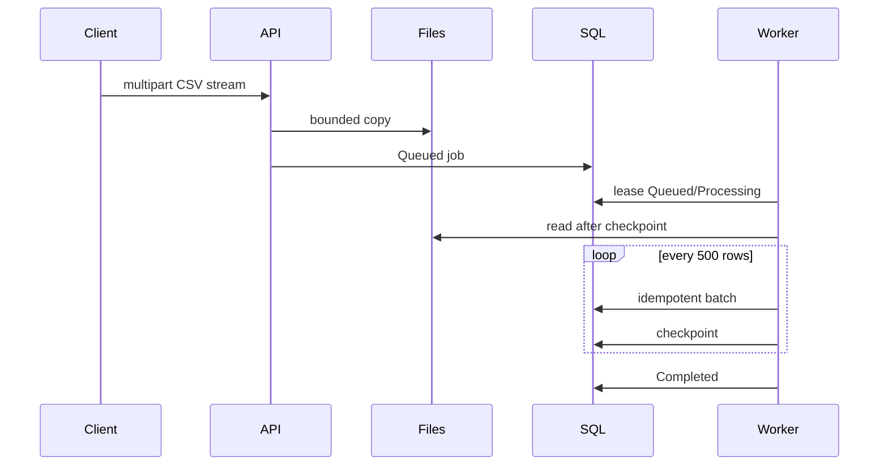

# Analytics & Reporting System Design

The file store owns immutable uploads. SQL owns job state, checkpoints, validated rows, and report indexes. Committing a Queued job is the durable queue boundary.

Lifecycle is `Queued → Processing → Completed|Failed`. A crash before checkpoint repeats at most one batch; the unique job/line key suppresses duplicate effects. A crash after checkpoint resumes at the next line. Malformed CSV records the failing line. File-copy failure precedes job creation, preventing dangling jobs.
