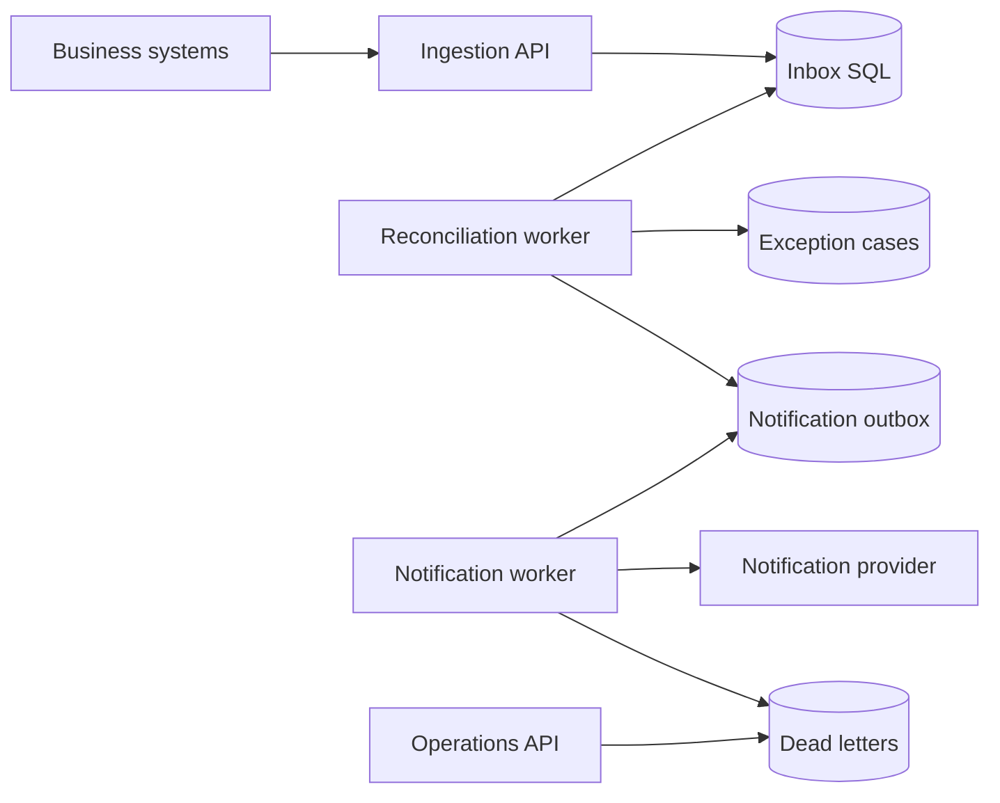
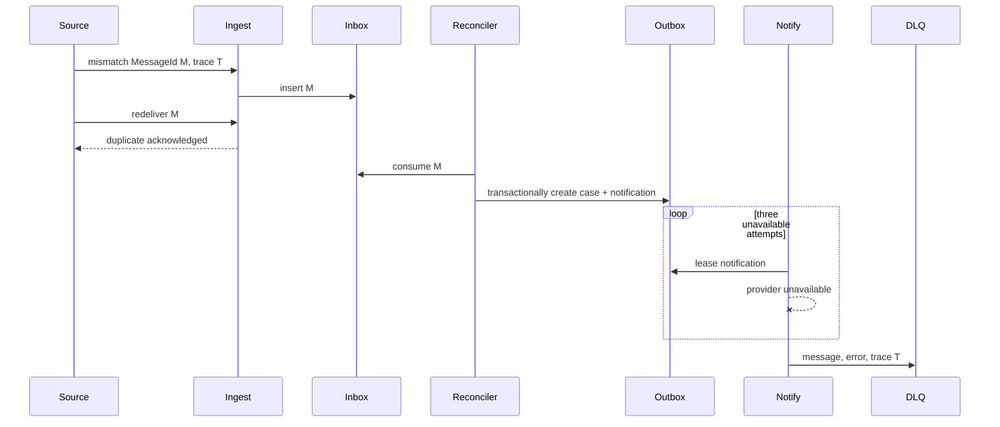

# Reconciliation Platform System Design

## Architecture and data ownership

Ingestion owns validation and transport identity. The reconciliation service owns business identity and exception cases. Notification owns delivery attempts. SQL constraints are final idempotency boundaries; workers are independently deployable and share only contracts and persistence schemas.

## Duplicate and outage sequence

## Lifecycle and failures

Inbox: `Received → Processed`. Notification: `Pending → Sent` or retry until `DeadLettered`. Raw payload and correlation survive each boundary. A crash before the reconciliation transaction commits leaves the inbox pending; after commit, both case and notification exist. A notification crash before Sent may redeliver, so production providers should also receive the notification ID as an idempotency key. Operators inspect `/api/reconciliation/dead-letters`, repair downstream dependencies, and replay deliberately rather than silently discarding messages.
